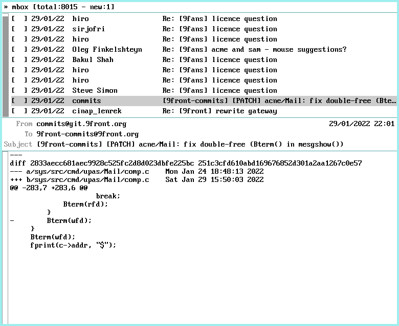

# mongrel
An opinionated mail reader for plan9 inspired by mutt.  
mongrel only provides reading functionality, writing is done using nedmail.  



If available, mongrel will use your current [theme](https://ftrv.se/14).

## Quick start
```sh
% mk install
% mongrel -m mbox
```

## Usage
mongrel has two components:
- the index which shows the list of messages
- the pager which shows an individual mail

Navigation in the index is done using the mouse, the arrow keys, page up/down, home and end. A left click on a given message will select it. Right-clicking or pressing `enter` will display the message content (in this case the pager will open if not displayed already).
Scrolling in the pager can be achieved with either the mouse or with a combination of pressing `alt` and the arrow keys or page up/down.  
The pager displays any attachments the message may have below the message headers. Right-clicking an individual attachment will send it to the plumber.  
`q` will hide the pager if it is open or quit mongrel if in the index.  
`Del` exit mongrel.

## License
MIT

## Bugs
This is work in progress and I already know of quite many of them.

