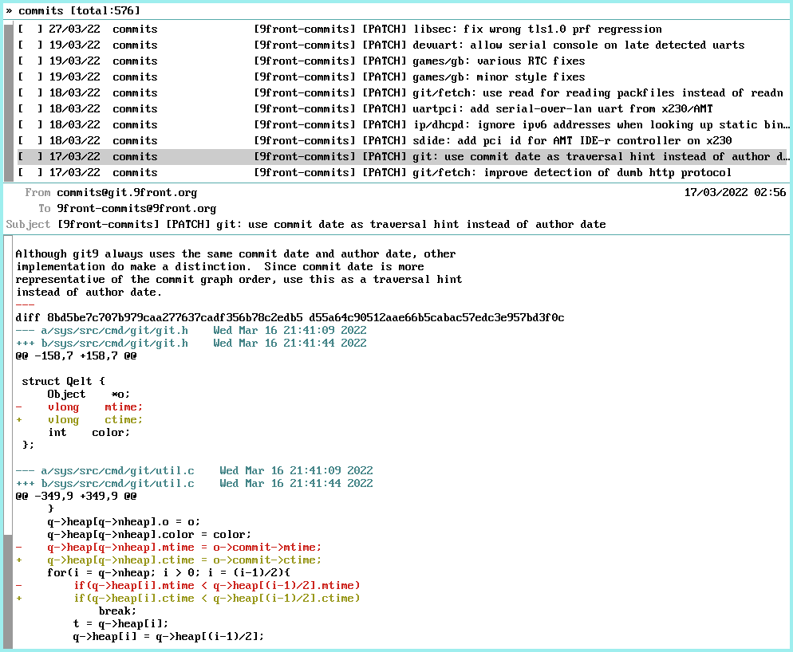

# mongrel
An opinionated mail reader for plan9 inspired by mutt.  
mongrel only provides reading functionality, writing is done using nedmail.  



If available, mongrel will use your current [theme](https://ftrv.se/14).

## Quick start
```sh
% mk install
% mongrel -m mbox
```

## Usage
mongrel has two components:
- the index which shows the list of messages
- the pager which shows the content of the mail currently selected in the index.

In the index, navigation is done using either the scrollbar or the mouse wheel. Selection can be changed using the arrow keys, page up, page down, home and end. A left click on a message will select it and display its content if the pager is open while a right click (or pressing `Enter`) will open the pager first and then display the message content. A middle click will open a menu with additional actions:
- plumb sends the message to the plumber which by default opens the message in nedmail (useful for answering/forwarding the message).
- delete deletes the message

In the pager, navigation is done using either the scrollbar or the mouse wheel. It is also possible to use keyboard navigation by pressing `Alt` in addition to the arrow keys, page up, page down, home and end.

Other shortcuts:
- `q` will hide the pager if it is open or quit mongrel if in the index.  
- `Del` exit mongrel.

## License
MIT

## Bugs
This is work in progress and I already know of quite many of them.

